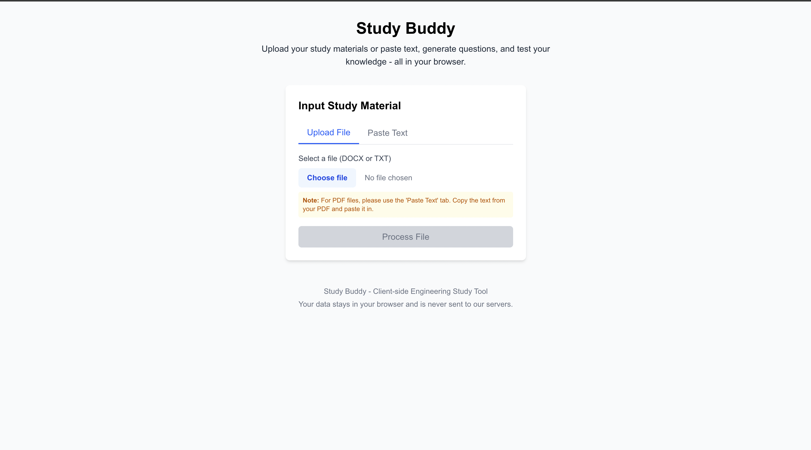

# Study Buddy - AI-Powered Engineering Study Assistant

Study Buddy is an AI-powered tool that helps engineering students test their knowledge by generating relevant practice questions from educational materials. Simply upload your notes, textbooks, or lecture materials (or paste text directly), and get custom multiple-choice questions to enhance your learning.

**Try it now**: [https://engineeringstudy-buddy.vercel.app/](https://engineeringstudy-buddy.vercel.app/)



## Features

- **Multiple Input Methods**: Upload DOCX and TXT files or paste text directly
- **Customizable Questions**: Control the number and difficulty level of questions
- **Multiple AI Options**: Choose between OpenAI (GPT-4o), Anthropic (Claude), or Grok models
- **Demo Mode**: Generate sample questions without requiring API keys
- **Interactive Study Interface**: Test your knowledge and track your progress
- **Privacy-Focused**: All processing happens in your browser; your data never leaves your device
- **Responsive Design**: Works on desktop and mobile devices

## Getting Started with Your Own Deployment

### Prerequisites

- Node.js 18.x or higher
- NPM or Yarn
- API keys for OpenAI, Anthropic, or Grok (optional)

### Installation

1. Clone the repository:
   ```bash
   git clone https://github.com/yourusername/study-buddy.git
   cd study-buddy
   ```

2. Install dependencies:
   ```bash
   npm install
   # or
   yarn install
   ```

3. Set up environment variables:
   - Copy `.env.local.template` to `.env.local`
   - Add your API keys for the AI services you want to use:
     ```
     OPENAI_API_KEY=your_openai_api_key
     ANTHROPIC_API_KEY=your_anthropic_api_key
     GROK_API_KEY=your_grok_api_key
     ```

4. Run the development server:
   ```bash
   npm run dev
   # or
   yarn dev
   ```

5. Open [http://localhost:3000](http://localhost:3000) to see the app running

### Using the App

1. **Input Study Material**:
   - Upload a DOCX or TXT file containing your study material
   - Or paste text directly into the textarea
   
2. **Configure Questions**:
   - Choose the number of questions (3-20)
   - Select difficulty level (Easy, Medium, Hard)
   - Pick an AI model (or use Demo mode)

3. **Generate Questions**:
   - Click "Generate Questions" to create your custom quiz

4. **Study and Test Your Knowledge**:
   - Answer the multiple-choice questions
   - Get immediate feedback
   - See explanations for correct answers
   - Review your score at the end

## Technology Stack

- **Frontend**: Next.js 14, React, TypeScript
- **Styling**: TailwindCSS
- **File Processing**: mammoth.js (DOCX)
- **AI Integration**: OpenAI API, Anthropic API, Grok API

## Customization

### Adding New AI Models

Edit `lib/aiService.ts` to integrate additional AI providers:

```typescript
export const generateWithNewAI = async (text, numQuestions, difficulty) => {
  // Implementation for your new AI provider
}
```

Then update the QuestionGenerator component to include the new option.

### Modifying Question Format

Edit the prompt template in `preparePrompt` function within `lib/aiService.ts` to customize the question format.

## Deployment

The easiest way to deploy your Study Buddy app is using the Vercel Platform:

1. Push your code to a GitHub repository
2. Import the project in Vercel
3. Add your environment variables (API keys)
4. Deploy

## Contributing

Contributions are welcome! Please feel free to submit a Pull Request.

## License

This project is licensed under the MIT License - see the LICENSE file for details.

## Acknowledgments

- Next.js team for the excellent framework
- OpenAI, Anthropic, and Grok for their powerful AI models
- The engineering education community for inspiration